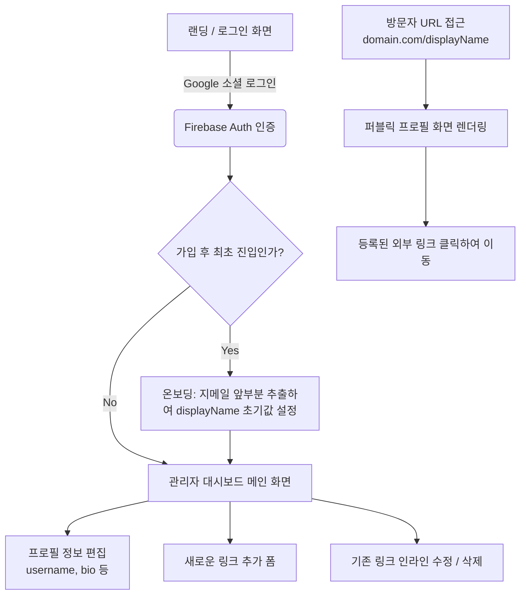

# 마이링크 (MyLink) 구조도 및 와이어프레임

## 1. 전체 화면 흐름도 (Mermaid)

애플리케이션의 기본적인 페이지 이동 및 동작 흐름을 시각화합니다.



---

## 2. 관리자 대시보드 화면 (ASCII Art)

PC 및 태블릿 환경에 맞춰진 심플하면서도 기능 직관적인 대시보드 화면 스케치입니다. 
(모바일 뷰어 미리보기 패널을 배제하고 폼 영역에 집중)

```text
========================================================================
 [ MyLink 로고 ]                                              [ 로그아웃 ]
========================================================================

 [ 내 프로필 관리 ]
 ----------------------------------------------------------------------
 디스플레이 네임 (URL로 사용됨) : [ seojunlee123       ]
 실제 이름 (Username)            : [ 이서준                ]
 짧은 소개글 (Bio)               : [ 프론트엔드 개발자입니다.    ]
                                                          [ 프로필 저장 ]
 ----------------------------------------------------------------------

 [ 내 외부 링크 목록 관리 ]
 ----------------------------------------------------------------------
 (+) 새로운 링크 추가하기
 URL 주소 : [ https://github.com/seojunlee...        ]
 링크 제목 : [ 최신 프로젝트 깃허브 레포지토리               ]
                                                          [ + 추가하기 ]
 ----------------------------------------------------------------------
 등록된 링크 내역 (최신 등록순)

  +-------------------------------------------------------------------+
  | [(G)파비콘] 최신 프로젝트 깃허브 레포지토리 (클릭 시 텍스트 수정 가능)         | [휴지통] |
  +-------------------------------------------------------------------+

  +-------------------------------------------------------------------+
  | [(B)파비콘] 기술 블로그 바로가기                                          | [휴지통] |
  +-------------------------------------------------------------------+

========================================================================
```

---

## 3. 퍼블릭 프로필 화면 (ASCII Art)

모바일 환경을 최우선으로 고려한 방문자 노출 뷰입니다. 가운데 정렬 기반의 UI를 따릅니다.

```text
           +---------------------------------------+
           |                                       |
           |                                       |
           |             이 서 준 (실제이름)        |
           |             @seojunlee123             |
           |                                       |
           |         프론트엔드 개발자입니다.       |
           |         (작성된 Bio 텍스트 중앙정렬)    |
           |                                       |
           |                                       |
           |  +---------------------------------+  |
           |  | [(G)] 최신 프로젝트 깃허브       |  |
           |  +---------------------------------+  |
           |                                       |
           |  +---------------------------------+  |
           |  | [(B)] 기술 블로그 바로가기       |  |
           |  +---------------------------------+  |
           |                                       |
           |  +---------------------------------+  |
           |  | [(I)] 인스타그램 계정            |  |
           |  +---------------------------------+  |
           |                                       |
           +---------------------------------------+
```
